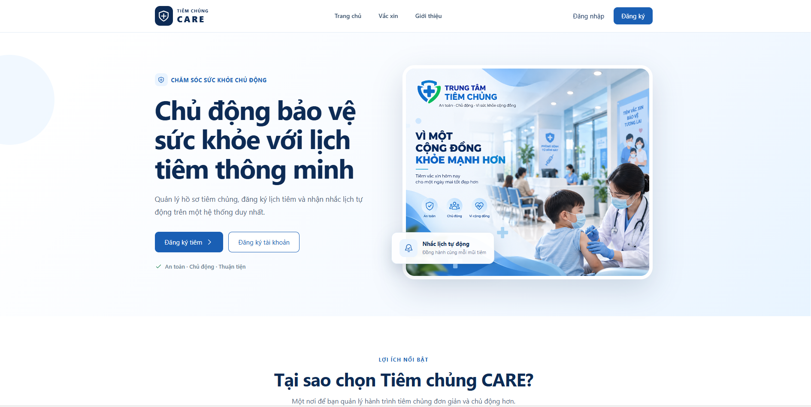
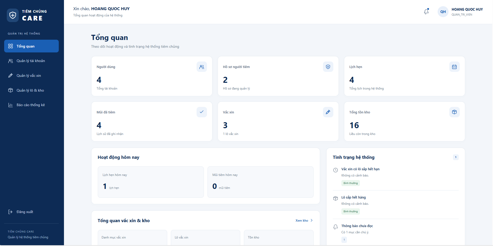

# 💉 TIÊM CHỦNG CARE
### Hệ thống Quản lý và Nhắc lịch Tiêm chủng Tự động

**Môn học:** Phát triển ứng dụng hướng đối tượng  
**Giảng viên hướng dẫn:** [Nguyễn Hồ Hải]  
**Sinh viên thực hiện:** Hoàng Quốc Huy  
**MSSV:** 23050093

---

## 📌 Giới thiệu đề tài

Hệ thống hỗ trợ quản lý hồ sơ người tiêm, đăng ký lịch tiêm chủng, quản lý vắc xin và kho vắc xin. Đồng thời, hệ thống tự động gửi email nhắc lịch tiêm nhằm giúp người dùng theo dõi lịch tiêm thuận tiện hơn.

## ⚙️ Chức năng chính

- **Khách hàng:** Đăng ký, đăng nhập, quản lý hồ sơ, đặt lịch tiêm, xem lịch sử tiêm và nhận thông báo.
- **Nhân viên:** Xác nhận lịch hẹn, ghi nhận mũi tiêm, lựa chọn lô vắc xin và theo dõi lịch sử tiêm.
- **Quản trị viên:** Quản lý tài khoản, vắc xin, phác đồ tiêm, kho vắc xin và báo cáo thống kê.
- **Nhắc lịch tự động:** Gửi email HTML nhắc lịch tiêm và mũi tiêm tiếp theo.

## 🛠 Công nghệ sử dụng

- **Backend:** Python, FastAPI, SQLAlchemy, JWT
- **Frontend:** ReactJS, Vite, JavaScript, HTML, CSS
- **Database:** PostgreSQL
- **Email:** SMTP Gmail
- **Scheduler:** APScheduler

## 🚀 Hướng dẫn cài đặt

### 1. Backend

```powershell
cd backend
python -m venv .venv
.\.venv\Scripts\Activate.ps1
pip install -r requirements.txt
```

Tạo file `.env` từ `.env.example`, cấu hình kết nối PostgreSQL và khóa JWT.

```powershell
python create_tables.py
uvicorn app.main:app --reload
```

Backend: `http://127.0.0.1:8000`  
Swagger API: `http://127.0.0.1:8000/docs`

### 2. Frontend

```powershell
cd frontend
npm install
npm run dev
```

Frontend: `http://localhost:5173`

## 📸 Giao diện hệ thống

### Trang chủ


### Dashboard

## 📚 Mục đích sử dụng

Dự án được xây dựng phục vụ mục đích học tập và nghiên cứu, không phải hệ thống y tế thương mại đang vận hành.